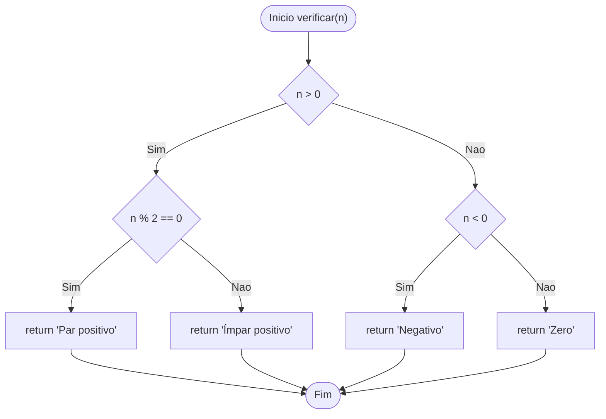
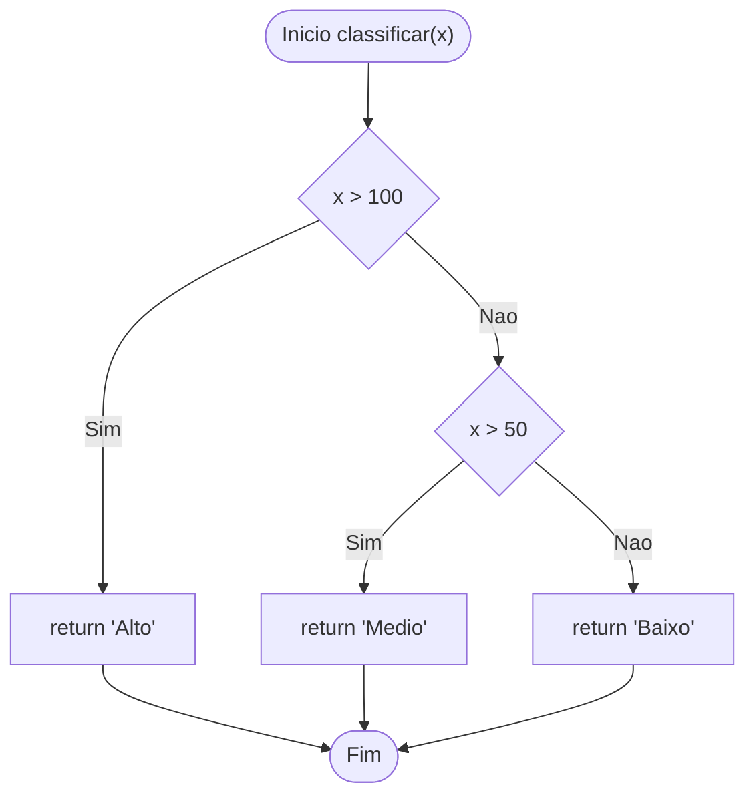
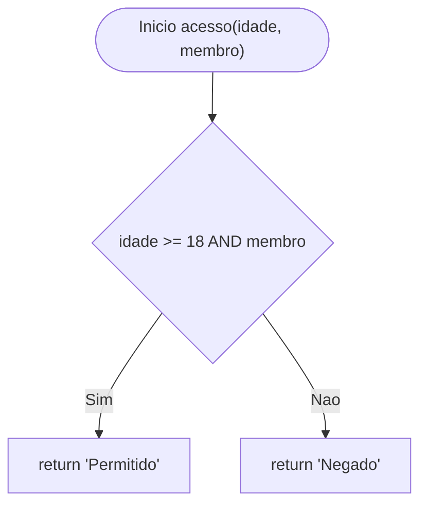
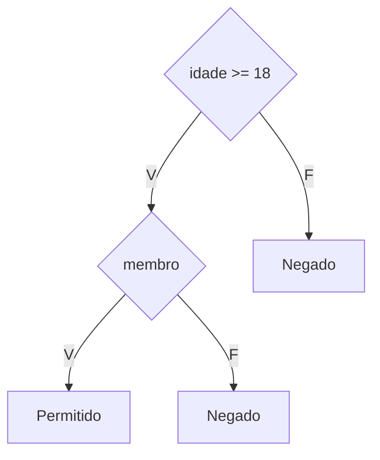
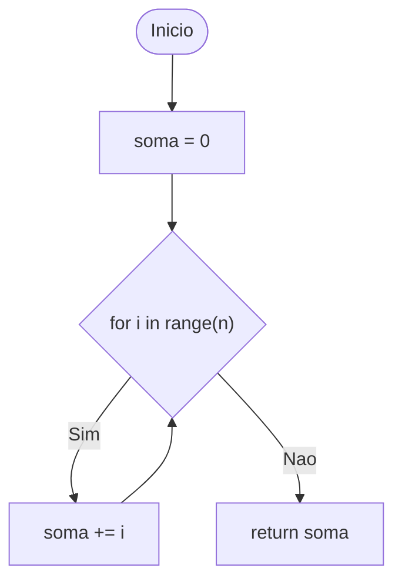
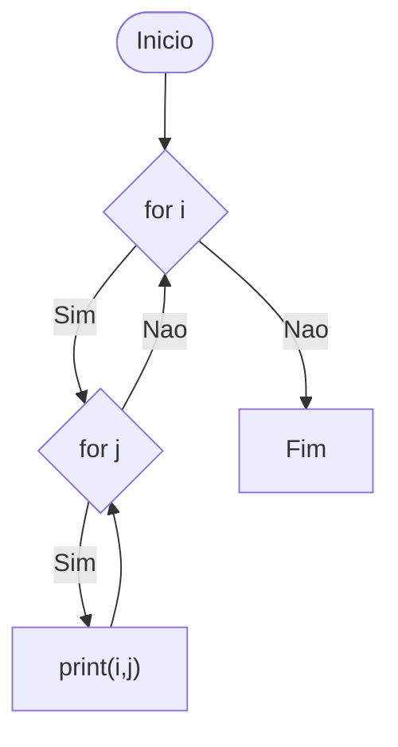
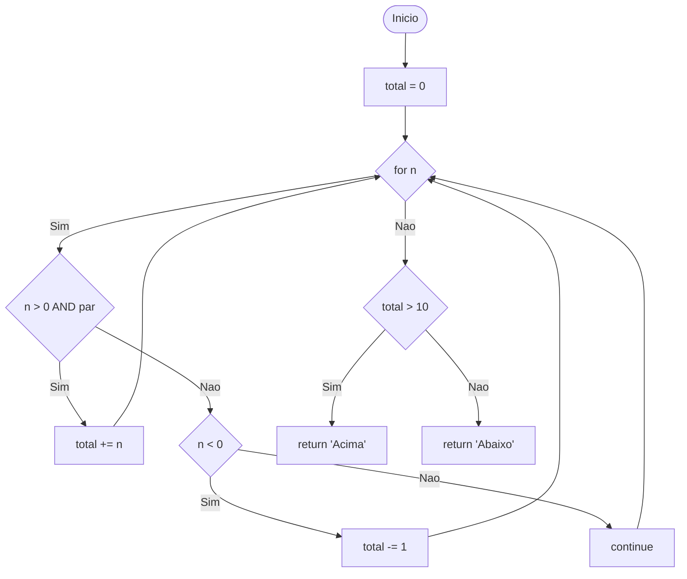
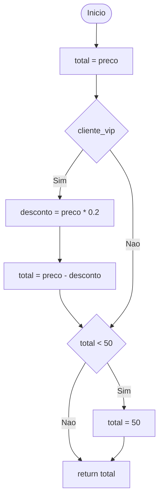
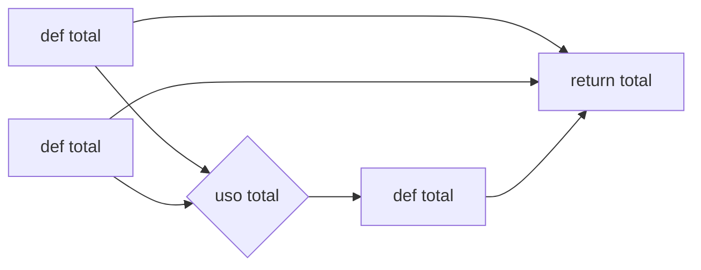

```markdown
# Atividade 04 — Testes de Software

---

# Exercício 1 — Caminhos Independentes

## 1.1 Código analisado

```python
def verificar(n):

    if n > 0:

        if n % 2 == 0:
            return "Par positivo"

        else:
            return "Impar positivo"

    elif n < 0:
        return "Negativo"

    else:
        return "Zero"
```

---

## 1.2 Grafo de Fluxo de Controle (GFC)



---

## 1.3 Complexidade Ciclomática

Fórmula:

```
V(G) = E − N + 2
```

Onde:

```
E = 9 arestas
N = 8 nós
```

Logo:

```
V(G) = 9 − 8 + 2 = 3
```

Verificação alternativa:

```
nº de decisões + 1
3 + 1 = 4
```

Assim, existem **4 caminhos independentes**.

---

## 1.4 Caminhos Independentes

| Caminho | Sequência de Nós  | Condições     | Entrada |
| ------- | ----------------- | ------------- | ------- |
| C1      | N1→N2(F)→N6(F)→N8 | n = 0         | 0       |
| C2      | N1→N2(F)→N6(V)→N7 | n < 0         | -1      |
| C3      | N1→N2(V)→N3(V)→N4 | n > 0 e par   | 2       |
| C4      | N1→N2(V)→N3(F)→N5 | n > 0 e ímpar | 3       |

---

## 1.5 Casos de Teste

| CT  | Entrada | Saída Esperada   |
| --- | ------- | ---------------- |
| CT1 | 0       | "Zero"           |
| CT2 | -1      | "Negativo"       |
| CT3 | 2       | "Par positivo"   |
| CT4 | 3       | "Ímpar positivo" |

---

# Exercício 2 — Cobertura de Comandos e Ramos

## 2.1 Código analisado

```python
def classificar(x):

    if x > 100:
        return "Alto"

    if x > 50:
        return "Medio"

    return "Baixo"
```

---

## 2.2 Grafo de Fluxo de Controle



---

## 2.3 Complexidade Ciclomática

```
V(G) = E − N + 2
V(G) = 6 − 5 + 2 = 3
```

ou

```
nº decisões + 1 = 2 + 1 = 3
```

---

## 2.4 Caminhos Independentes

```
C1: x > 100
C2: 50 < x ≤ 100
C3: x ≤ 50
```

---

## 2.5 Cobertura de Comandos (C0)

| CT  | x   | Retorno |
| --- | --- | ------- |
| CT1 | 150 | Alto    |
| CT2 | 75  | Medio   |
| CT3 | 30  | Baixo   |

---

## 2.6 Cobertura de Ramos (C1)

Os **mesmos 3 casos de teste** cobrem todos os ramos.

Logo:

```
C0 = C1 = 3 testes
```

---

# Exercício 3 — Cobertura de Condição

## 3.1 Código analisado

```python
def acesso(idade, membro):

    if idade >= 18 and membro:
        return "Permitido"

    return "Negado"
```

---

## 3.2 Grafo de Fluxo



---

## 3.3 Árvore de Condições



---

## 3.4 Casos de Teste

| CT  | idade | membro | retorno   |
| --- | ----- | ------ | --------- |
| CT1 | 20    | True   | Permitido |
| CT2 | 20    | False  | Negado    |
| CT3 | 15    | True   | Negado    |
| CT4 | 15    | False  | Negado    |

---

# Exercício 4 — Teste de Ciclo

## 4.1 Código

```python
def somar_ate(n):

    soma = 0

    for i in range(n):
        soma += i

    return soma
```

---

## 4.2 Grafo de Fluxo



---

## 4.3 Casos de Teste

| CT  | n  | Iterações | Resultado |
| --- | -- | --------- | --------- |
| CT1 | 0  | 0         | 0         |
| CT2 | 1  | 1         | 0         |
| CT3 | 5  | 5         | 10        |
| CT4 | 10 | 10        | 45        |

Fórmula geral:

```
soma = n × (n−1) / 2
```

---

# Exercício 5 — Ciclos Aninhados

## 5.1 Código

```python
def percorrer_matriz(m, n):

    for i in range(m):
        for j in range(n):
            print(f"Posicao ({i}, {j})")
```

---

## 5.2 Grafo de Fluxo



---

## 5.3 Casos de Teste

| CT  | m | n | prints |
| --- | - | - | ------ |
| CT1 | 0 | 0 | 0      |
| CT2 | 1 | 0 | 0      |
| CT3 | 1 | 3 | 3      |
| CT4 | 3 | 3 | 9      |

Propriedade:

```
prints = m × n
```

---

# Exercício 6 — Teste Integrado

## 6.1 Código

```python
def analisar(numeros):

    total = 0

    for n in numeros:

        if n > 0 and n % 2 == 0:
            total += n

        elif n < 0:
            total -= 1

        else:
            continue

    if total > 10:
        return "Acima"

    return "Abaixo"
```

---

## 6.2 Grafo de Fluxo



---

## 6.3 Casos de Teste

| CT  | numeros    | total | retorno |
| --- | ---------- | ----- | ------- |
| CT1 | []         | 0     | Abaixo  |
| CT2 | [2]        | 2     | Abaixo  |
| CT3 | [2,4,6]    | 12    | Acima   |
| CT4 | [-1,-1,-1] | -3    | Abaixo  |
| CT5 | [1,3,5]    | 0     | Abaixo  |

---

# Exercício 7 — Fluxo de Dados

## 7.1 Código

```python
def desconto(preco, cliente_vip):

    total = preco

    if cliente_vip:

        desconto = preco * 0.2
        total = preco - desconto

    if total < 50:
        total = 50

    return total
```

---

## 7.2 Grafo de Fluxo



---

## 7.3 Fluxo de Dados (Def-Use)



---

Link do arquivo Docs com as respostas: https://docs.google.com/document/d/1RHquYA6jhUPSlrOnjwelrdVjIzp9eO2I/edit?usp=sharing&ouid=103937993822110511313&rtpof=true&sd=true
